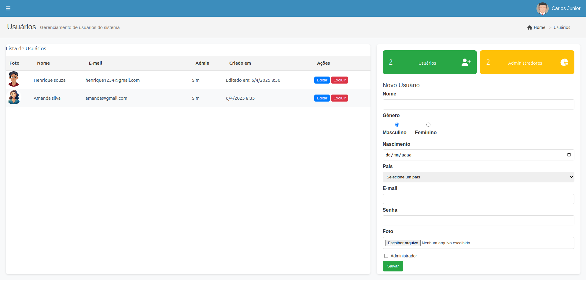

# Users Management — Vue

<p align="center">
  
</p>

<p align="center">
  Painel administrativo para gerenciamento de usuários, desenvolvido em <strong>Vue 3</strong> com <strong>Vite</strong>.
</p>

<p align="center">
  
  
  
  
</p>

<p align="center">
  
</p>

---

## 📌 Sobre o projeto

Aplicação front-end para **gerenciamento (CRUD) de usuários**, construída em **Vue 3** com **Composition API** e bundler **Vite**. O projeto simula um painel administrativo real, com listagem de usuários, cadastro, edição, exclusão e indicadores estatísticos.

Esta é a versão do projeto desenvolvida em Vue, complementar à versão construída em React, ambas com a mesma proposta funcional.

## ✨ Funcionalidades

- ➕ **Cadastro de usuários** — formulário completo com nome, gênero, data de nascimento, país, e-mail, senha, foto e permissão de administrador.
- 📷 **Upload de foto de perfil** — seleção e exibição da imagem do usuário, com avatar padrão para quem não possui foto.
- ✏️ **Edição de registros** — preenchimento automático do formulário para atualização dos dados de um usuário existente.
- 🗑️ **Exclusão de usuários** — remoção de registros da listagem.
- 📊 **Indicadores estatísticos** — cards com total de usuários cadastrados e total de administradores.
- 🧭 **Header com identidade visual** — cabeçalho com navegação, breadcrumb (Home > Usuários) e informações do usuário logado.
- 🎨 **Ícones com Font Awesome** — integração do Font Awesome ao Vue via `@fortawesome/vue-fontawesome`.
- 📱 **Layout responsivo** — componentes adaptados para diferentes tamanhos de tela.

## 🛠️ Tecnologias utilizadas

| Tecnologia | Uso no projeto |
|---|---|
| **Vue 3** | Construção da interface baseada em componentes (Composition API) |
| **Vite** | Bundler e servidor de desenvolvimento |
| **Sass** | Pré-processador CSS para estilização dos componentes |
| **Font Awesome** | Ícones utilizados na interface |
| **Vue DevTools** | Ferramenta de depuração durante o desenvolvimento |

## 📁 Estrutura do projeto

```
UsersManagement.Vue/
├── index.html
├── vite.config.js
├── jsconfig.json
├── package.json
├── src/
│   ├── assets/
│   │   ├── logo.png
│   │   └── main.css
│   ├── components/
│   │   ├── icons/
│   │   │   ├── IconCommunity.vue
│   │   │   ├── IconDocumentation.vue
│   │   │   ├── IconEcosystem.vue
│   │   │   ├── IconSupport.vue
│   │   │   └── IconTooling.vue
│   │   ├── Header.vue
│   │   ├── UsersHeader.vue
│   │   └── UsersForm.vue
│   ├── App.vue
│   └── main.js
└── README.md
```

## 🚀 Como executar o projeto

```bash
# 1. Clone o repositório
git clone https://github.com/seu-usuario/UsersManagement.Vue.git

# 2. Acesse a pasta do projeto
cd UsersManagement.Vue

# 3. Instale as dependências
npm install

# 4. Execute a aplicação em modo de desenvolvimento
npm run dev
```

A aplicação ficará disponível em `http://localhost:5173`.

### Build de produção

```bash
npm run build
npm run preview
```

## 🧠 Aprendizados

Este projeto teve como foco a prática de conceitos importantes do desenvolvimento com Vue:

- Componentização com Vue 3 e Composition API;
- Configuração de projeto com Vite, incluindo alias de importação (`@/`);
- Estilização de componentes com Sass;
- Integração de bibliotecas de terceiros ao Vue (Font Awesome);
- Estruturação de formulários controlados e listagem dinâmica de dados.

## 🔭 Possíveis evoluções

- [ ] Persistir os dados em uma API back-end real;
- [ ] Adicionar validação mais robusta dos campos do formulário;
- [ ] Implementar paginação e busca na listagem de usuários;
- [ ] Adicionar testes unitários com Vitest;
- [ ] Migrar o gerenciamento de estado para Pinia, caso o projeto escale.

## 👤 Autor

**Jean Carlos da Silva Gonçalves**
Desenvolvedor Front-end Júnior
